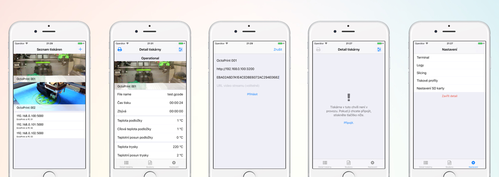

# OctoPhone - OctoPrint iOS client [](https://travis-ci.com/3DprintFIT/octoprint-ios-client) [](https://codebeat.co/projects/github-com-3dprintfit-octoprint-ios-client) [](https://codecov.io/gh/3DprintFIT/octoprint-ios-client)

OctoPhone is iOS client for OctoPrint v. 1.2.15.
The app is written in pure Swift, with MVVM architecture and reactive approach.

The source code is part of my [bachelor thesis](https://github.com/josefdolezal/fit-bi-bap) at FIT-CTU in Prague. Last commit included in final thesis is [53b3dca](https://github.com/3DprintFIT/octoprint-ios-client/tree/53b3dca3053785760a78baa0bea83cab48fd50e9). Since then, it's open source and ready for your contribution! :tada:



## Features

* Implements API of OctoPrint 1.2.15
* Automatically searches for printers on local network
* Shows video stream of current printing if it's available
* Print head controls
* Files management
* Terminal emulator
* Everythin' is reactive


## Setup

1. Install [Carthage](https://github.com/Carthage/Carthage) dependency manager
2. Install [SwiftLint](https://github.com/realm/SwiftLint) Swift linter
3. Install [SwiftGen](https://github.com/SwiftGen/SwiftGen) which generates translations
5. Run `$ carthage bootstrap --platform iOS`
6. Open `OctoPhone.xcodeproj`
7. :tada:

## Tests

This project also contains tests.
These are located at [OctoPhoneTests](OctoPhoneTests) and are used to test ViewModel layer.
You can run tests in Xcode with `cmd + u` keyboard shortcut.

## Dependencies

This project is build with a huge help of its dependencies:

* [Realm](https://github.com/realm/realm-cocoa) (MIT)
* [Alamofire](https://github.com/Alamofire/Alamofire) (Apache 2.0)
* [ReactiveSwift](https://github.com/ReactiveCocoa/ReactiveSwift) (MIT)
* [ReactiveCocoa](https://github.com/ReactiveCocoa/ReactiveCocoa) (MIT)
* [Moya](https://github.com/Moya/Moya) (MIT)
* [SnapKit](https://github.com/SnapKit/SnapKit) (MIT)

## Local usage

### Docker setup

You can run octoprint in docker for testing purposes (on virtual printer). Simply run docker container:

```bash
$ docker run -p"32768:5000" josefdolezal/virtuprint-docker

```

Octoprint now runs on port `32768`.

App should be able to find your docker OctoPrint instance and connect to it.

#### Login

In docker container is test user called `octophone` with `octophone` password. There is pregenerated access token for your app:

```
76DA2D98FFF8447681E1A5C6420B8F4F
```

Now you are set up. OctoPhone is now available to control virtual printer.
